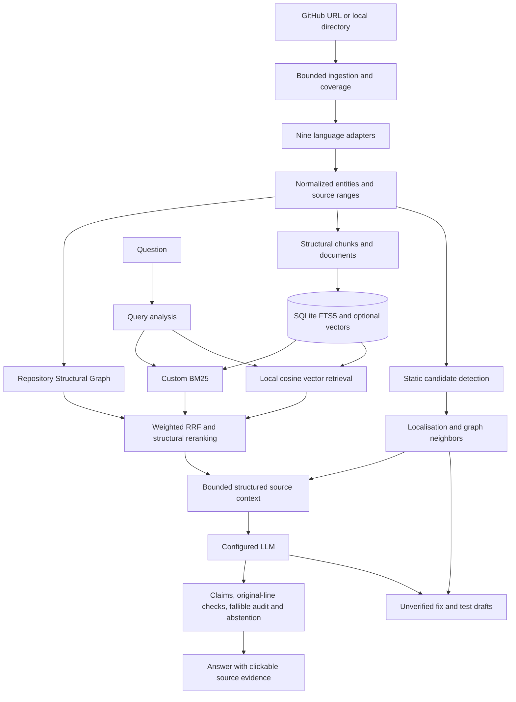

# Architecture

DevPilot is a local research prototype with a React/Vite UI, FastAPI backend, SQLite database and immutable source snapshots. The core is recommendation based: indexed code is not executed, and suggested patches are not applied.

## Boundaries

`languages.registry` dispatches by extension. Each adapter returns an `AnalysisResult` with normalized symbols, relationships, parser diagnostics and unresolved references. Adding a language requires a grammar dependency, parser/resolver adapter and registry entry, not changes to RAG. Python retains its tested AST resolver and Java retains its tested Tree-sitter resolver. The remaining adapters share extraction machinery with language-specific declaration maps and conservative resolution policies.

Symbols keep stable repository/file identity, language, kind, name, qualified name, signature, original line range, source, docstring, parent and file role. Compatibility names (`repo_id`, `qualified`, `parent_id`, `source`) stay available. Documents use overlapping original-coordinate windows; functions and classes remain structural chunks. Declared manifest dependencies and annotation/exception references are explicitly reference entities, not imaginary library implementations.

The graph combines stored static relationships with factual repository/file containment. Queries support symbol or file seeds, relationship filters, incoming/outgoing/both and 0–3 hops, with a maximum 500 output nodes. Normal retrieval expands a smaller bounded candidate set. It does not have control/data-flow analysis or compiler-grade typing.

The custom RAG modules own retrieval, fusion and ranking. No LangChain or LlamaIndex engine is used. Optional LangGraph orchestrates additional bounded passes and reuses the same engine and answer policy. It is not imported for ordinary questions. Its traces retain each pass.

## Storage and migration

SQLite tables retain repositories, files, symbols, edges, embeddings, investigations, coverage, unresolved references, persistent search statistics and prior reviewed-learning data. Schema v2 adds `chunks`, `issues`, `suggestions`, `retrieval_traces`, `evaluations`, normalized columns and indexes. Migration is additive and idempotent. Derived reindexing is transactional for symbols/edges/chunks; replaced symbol vectors are invalidated. Existing snapshots and fingerprints are preserved. Missing old file types require a fresh ingestion, not a derived rebuild.

The original database was backed up through SQLite's online backup API before migration under `.devpilot/refactor-backup-2026-10-04/`. This local backup and snapshot/model data are Git ignored.

## Providers and execution

`model_providers.py` defines chat and embedding contracts; configured implementations reuse the existing HTTP transport, connection pooling and local Ollama generation lock. Ollama's native chat supports schema-constrained output. OpenAI-compatible chat/embedding endpoints remain configurable; dimensions and provider/model/revision signatures invalidate incompatible vectors.

`backend/legacy/` retains historical Docker and guided repair experiments. Routes require an explicit flag, and the UI hides Verification by default. No Docker probe or execution is required by the core. Compatibility imports preserve earlier clients/tests.

See [RAG](custom-rag.md), [errors](error-analysis.md), [language limits](language-support.md) and [evaluation](research-evaluation.md) for actual behavior and limits.
