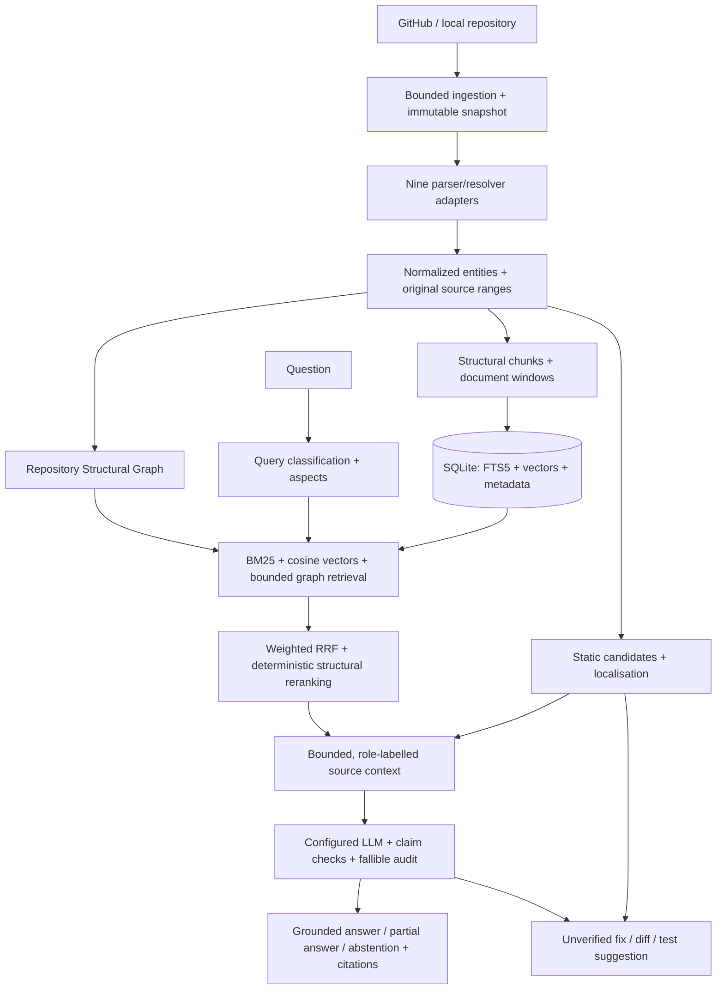

# DevPilot implementation report — 4 October 2026

The approved refactor is implemented as a working local research prototype. It preserves the existing ingestion, Python/Java analysis, provider transport, source validation, reviewed-learning data and useful tests, and adds nine-language adapters, a Repository Structural Graph, modular custom RAG, static issue analysis, unverified suggestions and retrieval experiments.

**The system generates candidate fixes and tests but does not execute or verify them.** Normal operation does not apply patches, execute indexed repository code, require Docker, or depend on LangGraph. This report describes implemented capabilities and measured checks; it is not a claim of complete repository understanding or guaranteed answer correctness.

## Running and using the implementation

The final server was restarted at `http://127.0.0.1:8000` with local `qwen2.5-coder:14b`, `nomic-embed-text:latest`, LangGraph disabled and legacy execution disabled. The UI and API documentation are served by the same FastAPI process. Restart it later with the command in the [README](../README.md). `./setup_and_run.sh` installs project dependencies and builds/starts the app when Python 3.11+, Git, Node.js 18+ and npm are available. It recognizes installed Ollama models; it does not install system prerequisites or download large models automatically.

Add a local directory or public GitHub URL, wait for Ready, inspect coverage and source, then ask questions. Click citations to open their original source lines. Dependencies offers bounded traversal and directed relationship cards. Error analysis reports static candidates and can investigate their causes or request fix/test drafts. Suggestions accepts specific requests. Retrieval diagnostics explains candidates; Research experiments compares modes using reviewed expected symbol IDs.

Without a chat model, source search, graph exploration and static analysis still work. Issue-based suggestions give static guidance. Without embeddings, hybrid falls back explicitly and semantic-only retrieval reports unavailability.

## Architecture and files

The [file manifest](../evaluation/implementation-2026-10-04/file-manifest.json) enumerates changed existing files, added files, retained compatibility aliases and the overall workspace Git status. The [manual file guide](file-guide.md) explains where to read each workflow.

| Area | Files and implementation |
| --- | --- |
| Existing files refactored | `ingestion.py`, `db.py`, `config.py`, `main.py`, `java_analysis.py`, `providers.py`, `proposals.py`, `question_analysis.py`, `search.py`, `readiness.py`, `evidence.py`, `test_links.py`, `agent_investigation.py`, compatibility aliases, frontend App/styles/main, setup/configuration and documentation |
| Language abstraction added | `backend/languages/base.py`, `registry.py`, shared `tree_parser.py`/`resolution.py`, and each language's parser/resolver package |
| Common structure added | `backend/models.py`, `structure.py`, `structural_metadata.py`, `graph.py`, `indexing.py`, `migrations.py` |
| Custom RAG added | `backend/rag/`: pipeline, chunking, lexical, embeddings, vector_store, graph_retrieval, fusion, reranker, context, citations, answer, abstention and settings |
| Errors/API/providers added | `backend/errors/`, `backend/api/research.py`, `backend/model_providers.py`, `backend/evaluation.py` |
| Frontend split and extended | Separate investigation, explorer, coverage, graph, errors, suggestions, research comparison and evaluation pages; shared API/UI helpers and error boundary |
| Validation added | Three research/language test modules, nine-language source fixture, rebuild and research-validation scripts, actual evaluation artifacts |
| Removed/deprecated | No source files removed. `retrieval.py`, `execution.py`, `agent_repair.py` retain compatibility aliases. Historical execution/repair implementations live in `backend/legacy/`; Verification is hidden by default. The old dependency page is retained; core uses the new bounded graph page. |

Pre-existing uncommitted accuracy work was preserved. The overall Git diff includes that earlier work and must not be attributed wholly to this refactor. The initial hash inventory covers 26 selected files, not the entire tree.

## Languages, entities and graph

Python, Java, JavaScript, TypeScript, C, C++, Go, Rust and C# have real official Tree-sitter grammars and registry adapters. Python retains AST scope analysis; Java retains declared receiver/import analysis. The other adapters use language-specific declaration maps and conservative resolution. TypeScript `.tsx` has its own grammar.

Common symbols include repository/file identity, language, kind, qualified name, signature, original line ranges, source, documentation, parent and role. Compatibility field names remain available. Parameters, selected variables, syntactic type/exception references, test references and literal manifest dependencies enrich definitions. Source, test, configuration, dependency manifest, documentation and build roles are recognized. Not every adapter extracts every entity kind.

Graph relationships include established containment, definitions, imports, calls, inheritance, references, accepts, returns, raises, tests, selected configuration links and manifest dependencies. `declared` references identify source text rather than asserting that external implementations were resolved. Queries accept symbol/file seeds, relationship filters, direction and depth 0–3; output is capped at 500 nodes and reports truncation. The UI displays directed relationship cards, source ranges and clickable traversal nodes, with a 40-edge visual cap and full returned data below.

This is a **Repository Structural Graph**, not a compiler-grade Code Property Graph. Complete API endpoint inference, implements/overrides resolution, documentation linking, data flow and control flow are not claimed. See the [language capability table](language-support.md) for each adapter's actual boundary.

## Custom RAG and grounding

1. Query analysis classifies the request, identifies entities and separates requested aspects.
2. Structural chunks retain definitions plus parent, imports, calls, callers/callees, inheritance and related tests. Documentation uses overlapping original-coordinate windows. Metadata is separate from stored source.
3. FTS5 finds bounded lexical candidates; custom repository-local BM25 scores their identifiers, qualified names, paths, documentation and code. Exact-match boosts are configurable.
4. The configured embedding provider produces vectors; our NumPy/cosine store ranks them. Incomplete or incompatible vector corpora cannot silently become successful semantic retrieval.
5. Lexical/semantic seeds guide bounded structural expansion. Graph mode uses lexical seeds; hybrid can use both. Edge types and direction influence expansion relevance.
6. Weighted reciprocal rank fusion deduplicates by symbol identity and retains lexical, cosine, graph, structural and final scores, retrieval sources and reasons. A deterministic reranker selects evidence from a larger candidate pool. Weights, candidate limits and reranking can be varied in experiments.
7. Context assembly shares a source budget across primary, dependency, caller, test and configuration evidence; it includes original lines and bounded relationship metadata.
8. The configurable chat provider generates structured claims. Checks validate source identity, line ranges, query-aspect coverage and selected overclaims; a separate model audit assesses support. The audit is fallible. Accepted status is `model_supported`, not proof of truth.
9. Answers include claims, confidence, missing information, related symbols and provenance. Insufficient evidence leads to partial source reporting or abstention. Clickable citations open the cited source line.

No LangChain or LlamaIndex RAG engine is used. Optional LangGraph orchestrates bounded additional passes over this custom engine. It is an optional dependency, with each pass's trace retained. The ordinary core starts without it installed.

Retrieval/answer traces record query analysis, settings, candidates, graph seeds/paths, fusion, reranking, context, claims and timings. Provider contracts expose `generate`, `structured_generate`, `embed` and `embed_batch`; configured implementations reuse the existing HTTP transport and local model lock.

## Error analysis, causes and suggestions

Static candidates include nine-language grammar recovery diagnostics, stronger Python AST syntax errors, invalid strict `package.json`, selected Python undefined names, duplicate top-level definitions, missing relative imports, direct signature mismatches and straight-line unreachable statements, plus informational import cycles. Unresolved calls alone are never automatically bugs. Rules avoid dynamic, decorated, ambiguous and shadowed cases where their assumptions do not hold.

Each candidate has repository/snapshot identity, severity/confidence, file/line/owner, evidence, related symbols, candidate cause and fix/test guidance. Localisation adds the smallest enclosing source definition and bounded graph neighbors. Cause investigation keeps this static explanation and optionally uses hybrid RAG for a cited model explanation; a failed model explanation is disclosed.

Fix generation retrieves source and repository test/manifest conventions. Exact indexed edits become a unified diff, checked for applicability with `git apply --check` only. Suggested tests receive syntax and selected framework-import checks. Test-only requests reject implementation edits. Saved outputs are `draft_unverified`, `verified=false`; the UI displays readable source/diffs and review requirements. Behavioral correctness, imports, build compatibility and regression effectiveness are not established by these checks. See [error analysis](error-analysis.md).

## API and database changes

Existing `/api/repositories`, question, source, history, coverage and reviewed-learning routes remain. Repository-scoped additions are:

| Method / path | Purpose |
| --- | --- |
| `GET /api/languages` | Actual adapter capabilities |
| `POST /api/repositories/{id}/rebuild-index` | Asynchronous derived rebuild from stored files, optional embeddings |
| `GET /api/repositories/{id}/graph/neighborhood` | Bounded structural traversal |
| `GET /api/repositories/{id}/symbols/{symbol}` | Symbol plus structural chunk metadata |
| `GET /api/repositories/{id}/errors` | Stored static candidates |
| `POST /api/repositories/{id}/errors/analyze` | Static candidate analysis |
| `POST /api/repositories/{id}/errors/{issue}/explain` | Source-backed cause investigation |
| `POST /api/repositories/{id}/fix-suggestions` | Unverified fix/test draft or static guidance |
| `POST /api/repositories/{id}/test-suggestions` | Test-only draft or guidance |
| `GET /api/repositories/{id}/fix-suggestions` | Saved drafts |
| `POST /api/repositories/{id}/retrieve` | Scores, evidence and saved trace |
| `GET /api/repositories/{id}/retrieval-traces` | Recent traces |
| `POST /api/repositories/{id}/research-evaluate` | Retrieval variants and ablations |
| `GET /api/repositories/{id}/research-evaluations` | Saved experiments |

SQLite schema v2 adds `chunks`, `issues`, `suggestions`, `retrieval_traces`, `evaluations`, file IDs/roles, symbol language/signature/role and lookup indexes. Existing source, fingerprints, histories and learning data remain. A SQLite online backup was made before migration. All **40 original repository records** remain; one development fixture was added (41 total). A [backup comparison](../evaluation/implementation-2026-10-04/data-preservation.json) checks original IDs/fingerprints/source/name, indexed file counts and history/review counts; it is not a fresh byte-by-byte hash of every stored file.

Older derived indexes are not automatically rewritten. The UI warns and offers rebuilding. Rebuild preserves stored source/fingerprint and replaces derived symbols/edges/chunks while invalidating obsolete vectors. It cannot recover files previously excluded from ingestion. Changed symbol IDs require refreshed reviewed labels.

## Verification and measured results

| Check | Actual result |
| --- | --- |
| Existing baseline | 134 passed, 1 skipped |
| Final automated suite | **186 passed, 1 skipped**; the skipped check requires Docker, outside the default core |
| Python quality | Ruff check passes; 150 Python files pass format check |
| Frontend | Prettier check and Vite production build pass |
| Bootstrap | `./setup_and_run.sh --setup-only` completed installation/build; detected installed Qwen 7B and Nomic |
| Isolated package | Core installed in a separate environment; tested outside the checkout with LangGraph absent; startup, OpenAPI, nine capabilities and real TypeScript parsing pass |
| Local provider integration | Actual Qwen 14B/Nomic answers, static analysis, cause investigation, fix/test drafts and unsupported-deployment abstention exercised |
| Final deployed API | Health/OpenAPI/nine languages pass; fixture rebuild preserves fingerprint and refreshed chunk metadata; two candidates detected; actual generated Python guard answer and deployment-state abstention pass |
| Manual UI integration | Errors/source navigation, 1/2-hop graph, clickable node traversal, retrieval scores, saved readable test draft, actual answer/clickable citation and research comparison results checked in Safari |
| Larger index smoke | Pydantic: 765 files, 33,301 symbols, 44,923 edges; index timing 15.061 s, analysis+graph 11.318 s. Full index/two-query/graph check took 18.297 s; bounded graph reports truncation. No embeddings/model answers/target tests in this smoke. |

Four authored development retrieval questions compare 14 configurations. These results use real rankings and expected snapshot symbols:

| Variant | Mean Recall@5 | Mean MRR@5 | Mean NDCG@5 |
| --- | ---: | ---: | ---: |
| Lexical, no structural reranking | 0.625 | 0.425 | 0.467 |
| Lexical with structural reranking | 1.000 | 0.675 | 0.734 |
| Semantic | 0.625 | 0.417 | 0.452 |
| Graph with lexical seeds and reranking | 1.000 | 0.675 | 0.734 |
| Hybrid | 1.000 | 0.562 | 0.689 |
| Hybrid without graph | 1.000 | 0.562 | 0.689 |
| Hybrid without reranking | 0.625 | 0.583 | 0.577 |

Hybrid and structured lexical both retrieved all required evidence at 5 on these four questions. Structured lexical ranked the evidence better and was faster here. **These cases do not demonstrate an independent graph contribution or establish optimal hybrid weights.** Depth/weight variants and the other ablations are saved, including results without structure/semantic/lexical.

The two deliberately labelled Python candidates match type/file/line: TP=2, FP=0, FN=0, precision/recall/F1=1.0. This tiny fixture is not a representative bug-detection benchmark. True negatives are not invented from unflagged lines; they require a reviewed negative population.

Source inspection checked two final model answers (Python nonpositive guard and TypeScript delegation), a two-versus-three-argument cause explanation, and the candidate diff/test. This review was by Codex, not independent human reviewers. Initial runs included an overbroad claim, a missing test-framework import and failed cause validation; these artifacts are retained. Guards were tightened and final outputs rechecked rather than discarding failure evidence.

Final validation answer timings were approximately 14.6 s (Python), 58.7 s (TypeScript with retry), and 45.6 s (cause). The restarted API's additional Python answer took 35.8 s. These are observed local runs, not latency guarantees. Retrieval, graph, ranking and provider timings/usage are recorded separately where available.

Evidence: [final tests](../evaluation/implementation-2026-10-04/final-tests.txt), [validation summary](../evaluation/implementation-2026-10-04/validation-summary.json), [final live outputs](../evaluation/implementation-2026-10-04/live-final-validation.json), [candidate fix](../evaluation/implementation-2026-10-04/live-error-fix.json), [deployment check](../evaluation/implementation-2026-10-04/deployment-check.json), [bootstrap](../evaluation/implementation-2026-10-04/bootstrap-check.txt), [package check](../evaluation/implementation-2026-10-04/core-install.json), [Pydantic smoke](../evaluation/implementation-2026-10-04/pydantic-index-smoke.json).

## Remaining limitations and research status

- Nine-language parsing is implemented; semantic depth is unequal. Python/Java remain stronger. Dynamic dispatch, full type/overload resolution, macros, generated code, cross-language linking and framework runtime wiring are incomplete. `.h` defaults to C; `.pyi` and Kotlin are searchable text.
- Static diagnostics are conservative candidates, with false positives and omissions possible. General interface enforcement, unused-code analysis, type/API mismatches and all 18 proposed issue classes are not claimed.
- Claim/range/audit checks reduce selected errors but cannot guarantee correctness or completeness. A valid citation proves provenance, not entailment. Large or multi-hop questions may require more evidence than the bounded context includes.
- Vector search is exact NumPy cosine, without ANN/FAISS. Graph outputs are bounded, but graph metadata loading still scales with the repository. Default ingestion limits and exclusions mean the indexed snapshot may omit content; inspect Coverage.
- The new fixture is development data, not independent holdout evidence. Error cause/fix/test and answer correctness still need broader independently reviewed datasets. Previous complex-repository answer failures remain in their original reports; this work did not re-run or erase that benchmark.
- No new model training/fine-tuning was performed. Indexing stores repository content without changing Qwen's weights. The existing reviewed-learning loop remains available.
- Docker execution was not validated in this run and is unnecessary for the core. Optional LangGraph regression tests passed in the existing environment, while the isolated core check proved it is not required. Every supported operating system/Python version was not tested; actual installation was on this Mac with Python 3.14.
- Suggestions are intentionally unverified. Developers must review and manually apply/run them. They are not successful repairs simply because a diff or test parses.

The implemented prototype is ready for local use and further honest evaluation. Broader accuracy and graph contribution require repository-level held-out tests and independent source review, not larger claims based on these small checks.
